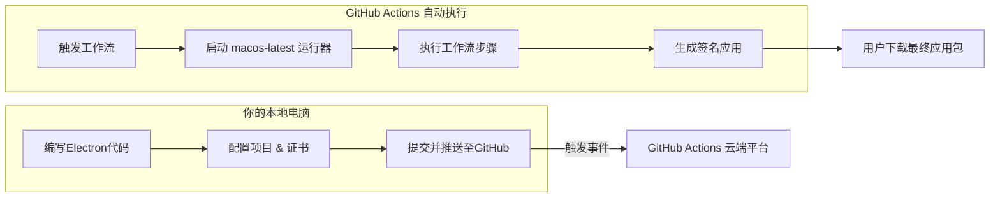

下面这份完整指南将帮助你理解相关概念，并实现使用 GitHub Actions 的 `macos-latest` 运行器来自动化打包、签名 Electron 的 macOS 应用。

### 📖 核心概念解析
在开始前，了解这些核心概念有助于你更好地理解后续流程：

| 概念 | 解释 |
| :--- | :--- |
| **GitHub Actions** | GitHub 提供的**持续集成/持续交付 (CI/CD)** 平台。你可以创建**工作流 (Workflow)** 来自动化完成软件的构建、测试、打包和发布。 |
| **运行器 (Runner)** | 执行工作流的**虚拟环境**。`macos-latest` 是 GitHub 托管的运行器标签，指向**最新版本的 macOS 系统**（例如当前是 macOS 15）。它是**合法、纯净**的苹果官方环境。 |
| **工作流文件 (Workflow File)** | 一个位于 `.github/workflows/` 目录下的 **YAML 格式** 配置文件。它定义了何时触发以及如何执行自动化任务。 |
| **动作 (Action)** | 可复用的自动化步骤，是 GitHub Actions 生态的“积木”。例如 `actions/checkout` 用于拉取代码，`actions/setup-node` 用于安装 Node.js。 |
| **代码签名 (Code Signing)** | 使用苹果颁发的**开发者证书**对应用进行数字签名的过程。这是 macOS 应用能够正常分发和安装的**强制性安全要求**。 |
| **公证 (Notarization)** | 苹果在 macOS 10.15 (Catalina) 后引入的安全扫描流程。经过公证的应用在首次启动时，将**不会出现“无法验证开发者”的警告**。 |
| **GitHub Secrets** | GitHub 仓库中用于安全存储敏感信息（如证书、密码）的功能。在工作流运行时，可以安全地引用这些信息。 |

### 🔄 完整自动化打包流程
整个流程可以概括为下图所示步骤，你只需要在本地编写代码和配置，后续所有复杂工作都由 GitHub 在云端自动完成：



### 📝 详细步骤指南
接下来，请按照以下步骤操作：

#### 步骤一：准备苹果开发者证书与专用密码
这是最关键的一步，为签名和公证提供凭证。
1.  **获取开发者证书**：你需要一个付费的 **Apple Developer Program** 会员（$99/年）。在苹果开发者后台创建类型为 **“Developer ID Application”** 的证书，下载 `.cer` 文件，并在本地钥匙串或终端中导出为包含私钥的 **`.p12`** 文件。
2.  **生成应用专用密码**：用于公证流程。在苹果账号管理页面生成，**务必立即保存**，因为它只显示一次。

#### 步骤二：配置 Electron 项目
1.  **安装打包工具**：确保项目已安装 `electron-builder`。
    ```bash
    npm install electron-builder --save-dev
    ```
2.  **配置 `package.json`**：在 `build` 字段中添加针对 macOS 的配置。
    ```json
    "build": {
      "appId": "com.yourcompany.yourapp",
      "productName": "YourApp",
      "mac": {
        "category": "public.app-category.utilities",
        "target": "dmg",
        "hardenedRuntime": true, // 必须为 true 以支持公证
        "entitlements": "build/entitlements.mac.plist", // 权限配置文件
        "entitlementsInherit": "build/entitlements.mac.plist",
        "gatekeeperAssess": false
      },
      "afterSign": "scripts/notarize.js" // 公证后脚本
    }
    ```
3.  **创建权限文件**：在项目根目录创建 `build/entitlements.mac.plist` 文件，内容可参考以下基础配置：
    ```xml
    <?xml version="1.0" encoding="UTF-8"?>
    <!DOCTYPE plist PUBLIC "-//Apple//DTD PLIST 1.0//EN" "http://www.apple.com/DTDs/PropertyList-1.0.dtd">
    <plist version="1.0">
    <dict>
        <key>com.apple.security.cs.allow-jit</key>
        <true/>
        <key>com.apple.security.cs.allow-unsigned-executable-memory</key>
        <true/>
        <key>com.apple.security.cs.disable-library-validation</key>
        <true/>
    </dict>
    </plist>
    ```
4.  **创建公证脚本**：在 `scripts/notarize.js` 文件中，配置公证流程。

#### 步骤三：配置 GitHub Actions 工作流
在项目根目录创建 `.github/workflows/build-mac.yml` 文件。
```yaml
name: Build and Sign macOS App

on:
  push:
    tags:
      - 'v*' # 仅当推送 v 开头的标签（如 v1.0.0）时触发，避免每次提交都构建

jobs:
  build:
    runs-on: macos-latest # 使用最新的 macOS 运行器

    steps:
      - name: Checkout code
        uses: actions/checkout@v4

      - name: Setup Node.js
        uses: actions/setup-node@v4
        with:
          node-version: '18'

      - name: Install dependencies
        run: npm ci

      - name: Import Code Signing Certificate
        # 使用专门的 Action 导入证书，比手动命令更可靠
        uses: Apple-Actions/import-codesign-certs@v2
        with:
          p12-file-base64: ${{ secrets.MACOS_CERT_P12_BASE64 }}
          p12-password: ${{ secrets.MACOS_CERT_PASSWORD }}

      - name: Build and Notarize
        run: npm run build:mac # 此命令需在 package.json 的 scripts 中定义，例如："build:mac": "electron-builder --mac"
        env:
          # 以下环境变量会被 electron-builder 和 notarize.js 脚本自动读取
          APPLE_ID: ${{ secrets.APPLE_ID }}
          APPLE_ID_PASS: ${{ secrets.APPLE_APP_SPECIFIC_PASSWORD }}
          APPLE_TEAM_ID: ${{ secrets.APPLE_TEAM_ID }}

      - name: Upload Artifact
        uses: actions/upload-artifact@v4
        with:
          name: macOS-App-DMG
          path: dist/*.dmg # 上传生成的 dmg 文件
```

#### 步骤四：在 GitHub 仓库设置机密 (Secrets)
进入你的 GitHub 仓库 **Settings → Secrets and variables → Actions**，点击 **New repository secret**，添加以下机密：
*   **`MACOS_CERT_P12_BASE64`**: 将 `.p12` 证书文件进行 **Base64 编码**后的完整字符串。
    *   **关键提示**：编码时必须去除换行符，否则可能导致工作流出错。在终端执行：
        ```bash
        openssl base64 -in your_cert.p12 | tr -d '\n' | tee certificate-base64.txt
        ```
        然后将 `certificate-base64.txt` 文件的内容完整粘贴作为此机密的值。
*   **`MACOS_CERT_PASSWORD`**: 导出 `.p12` 证书时设置的密码。
*   **`APPLE_ID`**: 你的苹果开发者邮箱。
*   **`APPLE_APP_SPECIFIC_PASSWORD`**: 在步骤一中生成的**应用专用密码**。
*   **`APPLE_TEAM_ID`**: 你的苹果开发者团队ID，可在苹果开发者后台找到。

完成以上所有配置后，**推送一个版本标签（如 `git tag v1.0.0 && git push --tags`）到 GitHub，即可自动触发构建流程**。你可以在仓库的 **Actions** 标签页查看实时日志。

### 💡 注意事项与常见问题
*   **免费额度**：公开仓库完全免费。私有仓库每月有 2000 分钟的免费额度，但使用 **`macos` 运行器消耗额度更快**（1分钟实际消耗10分钟额度）。
*   **多架构构建**：`electron-builder` 在 `macos-latest` 上默认会构建同时支持 Intel (`x64`) 和 Apple Silicon (`arm64`) 芯片的**通用应用程序 (Universal App)**。
*   **跨平台开发**：此方案最大的优势是，你完全可以在 **Windows 或 Linux 电脑上**完成上述所有配置和代码开发，最终的 macOS 打包签名工作将全权交由 GitHub Actions 在云端完成。

如果在配置过程中遇到具体错误（例如证书导入失败、公证步骤报错），可以告诉我具体的错误信息，我能帮你进一步分析和排查。
